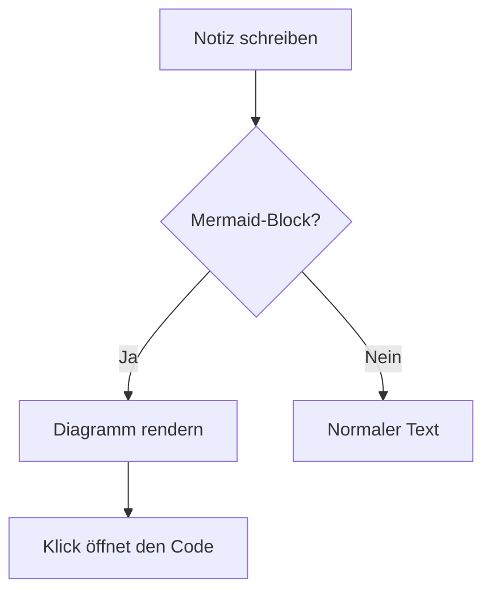
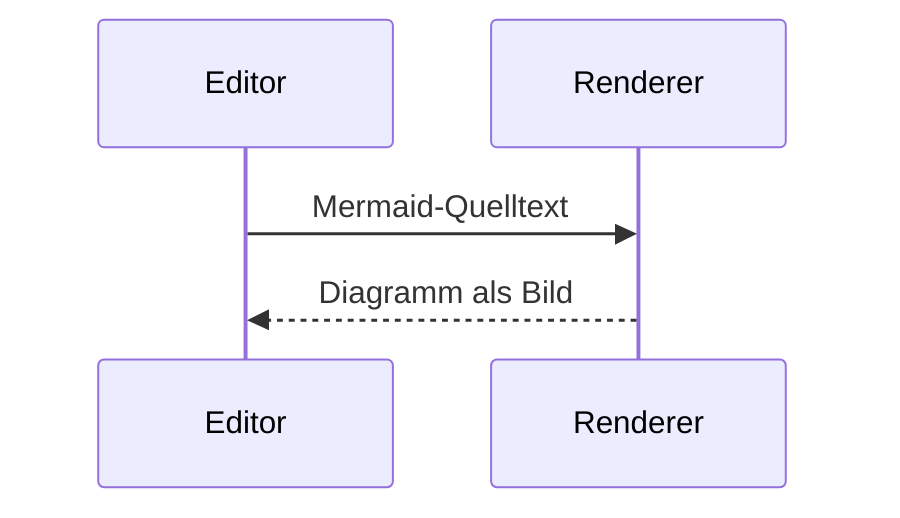

# Diagramme

Mermaid-Codeblöcke werden als Diagramm angezeigt. Ein Klick auf das Diagramm
öffnet den Quelltext; verlässt der Cursor den Block, wird wieder gerendert.

Auch Sequenzdiagramme funktionieren:

