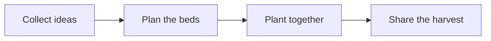

# A garden for the neighbourhood

A small shared garden can be a place to grow food, learn together and meet the people next door.

## From idea to harvest

## A simple starting point

| Bed | Plants | First task |
| --- | --- | --- |
| Sunny corner | Tomatoes and basil | Prepare the soil |
| Along the fence | Peas and beans | Add supports |
| Near the entrance | Mint and thyme | Label the pots |

## Next steps

See the [project plan](Plan.md) for the practical details.

All names, plans and information in this notebook are fictional demonstration content.
